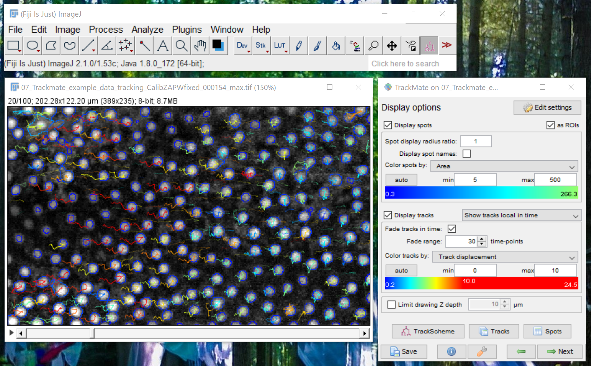
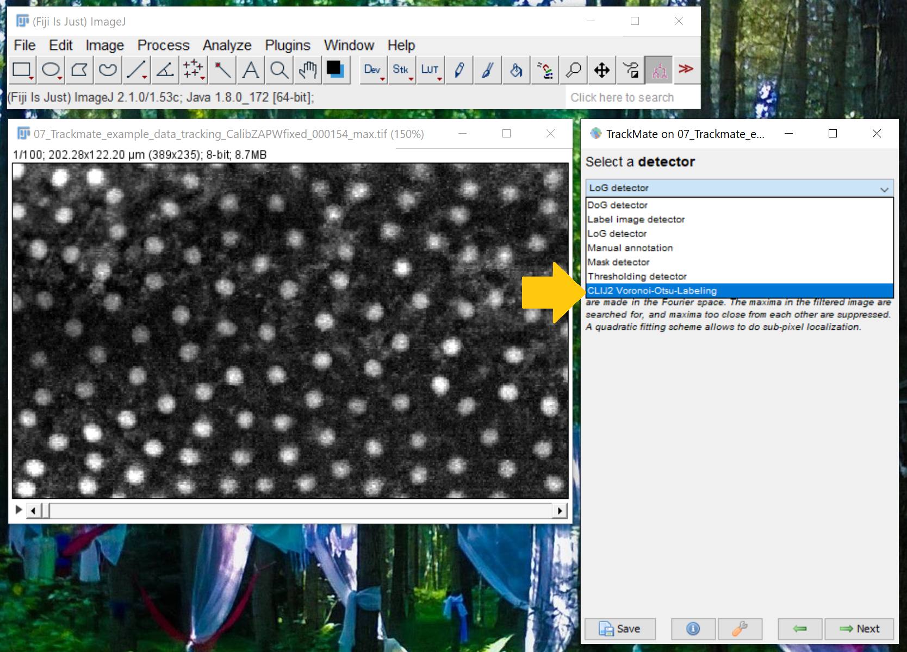
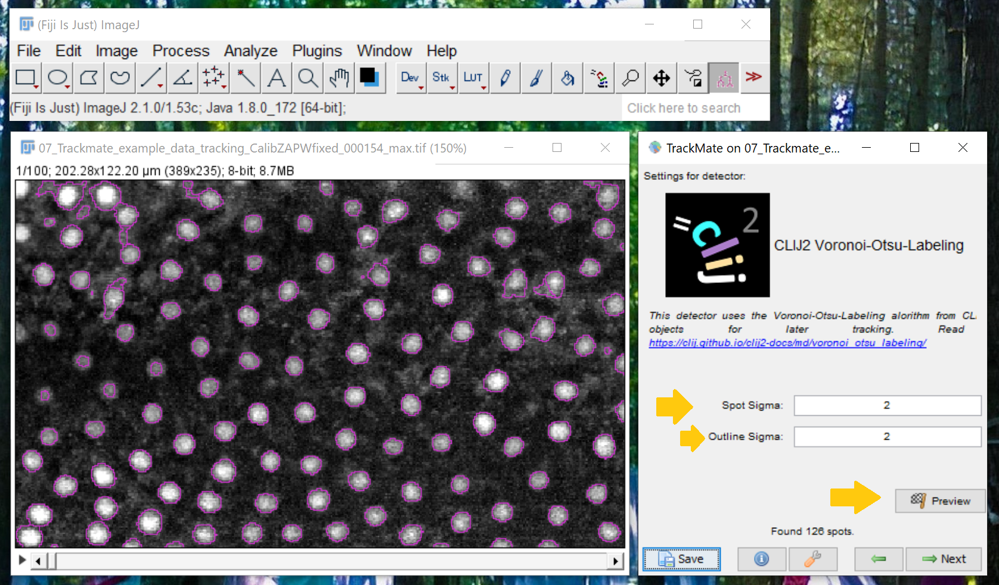
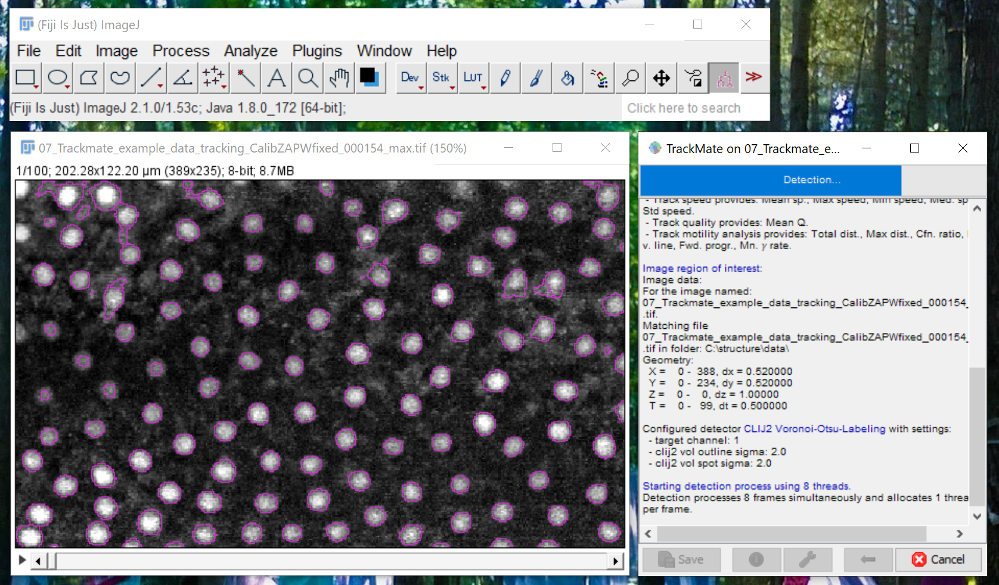
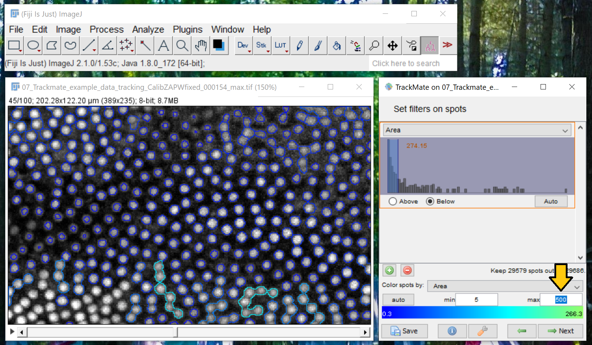
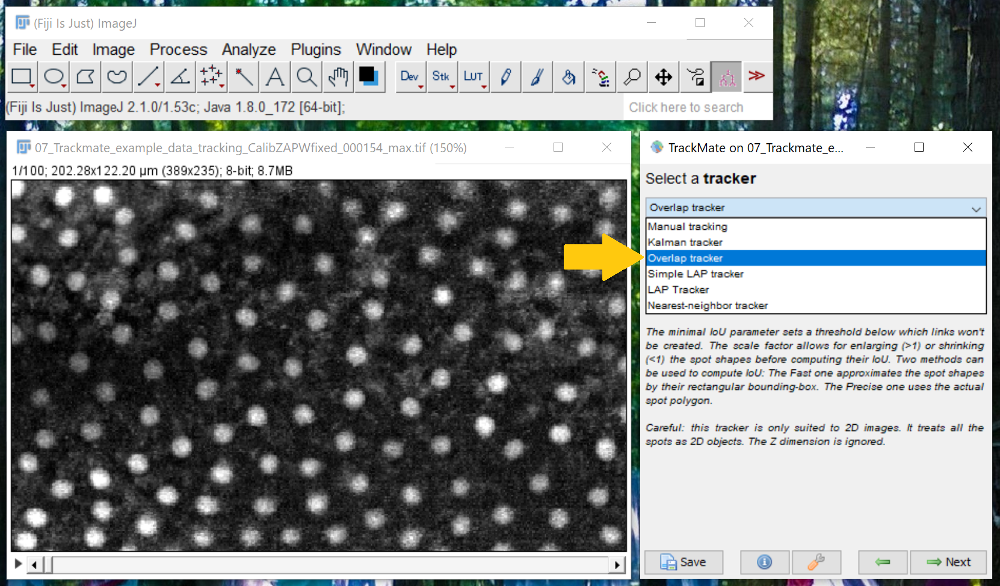
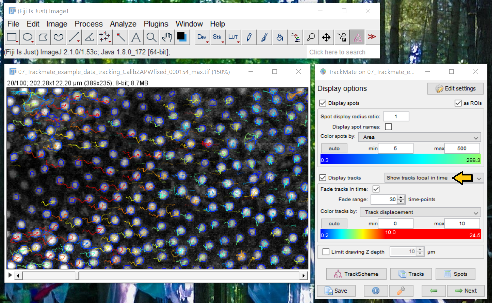

TrackMate-clij2
===============

A [clij2](https://clij.github.io) plugin for [TrackMate](https://imagej.net/plugins/trackmate/).

This plugin was inspired by [TrackMate-Examples](https://github.com/fiji/TrackMate-examples), [TrackMate-MorpholibJ](https://github.com/tinevez/TrackMate-MorphoLibJ) and [TrackMate-StarDist](https://github.com/tinevez/TrackMate-StarDist) 
and this [preprint by Dimitry Ershov](https://www.biorxiv.org/content/10.1101/2021.09.03.458852v1.full).

# Installation

* Download and install [Fiji](https://fiji.sc/Downloads)
* Install [clij](https://clij.github.io/clij2-docs/installationInFiji)

# Usage

* Open a dataset and start TrackMate from the `Plugins > Tracking` menu.
* In the 2nd step (Select Detector), choose `CLIJ2 Voronoi Otsu Labeling`.

* When configuring the detector, enter `spot-sigma` to fine-tune how close objects can be and `outline_sigma` to control how precise outlines are. 
  Read more in the [Voronoi-Otsu-Labeling tutorial]

* Wait a moment :-)

* In further processing, it is recommended to filter detected spots by their area.

* Therefore, it might be helpful to change the visualization by adapting the maximum shown area. This makes objects better visible that stick to each other.

* For tracking, the overlap tracker is recommended.

* For visualization, select 'Show tracks local in time'.

## Feedback and support
CLIJ is developed in the open because we believe in the open source community. 
See our [community guidelines](https://clij.github.io/clij2-docs/community_guidelines). 
Feel free to drop feedback or ask questions via [image.sc](https://image.sc). 

[Imprint](https://clij.github.io/imprint)
